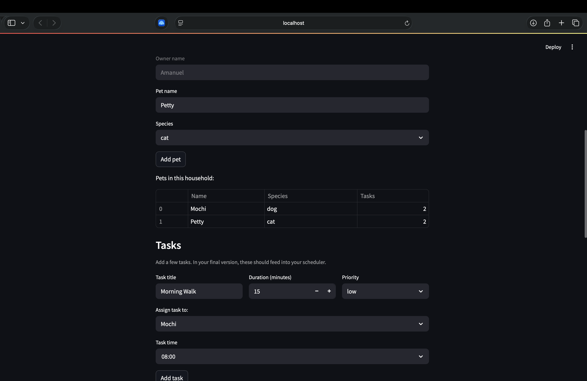

# PawPal+ (Module 2 Project)

You are building **PawPal+**, a Streamlit app that helps a pet owner plan care tasks for their pet.

## Scenario

A busy pet owner needs help staying consistent with pet care. They want an assistant that can:

- Track pet care tasks (walks, feeding, meds, enrichment, grooming, etc.)
- Consider constraints (time available, priority, owner preferences)
- Produce a daily plan and explain why it chose that plan

Your job is to design the system first (UML), then implement the logic in Python, then connect it to the Streamlit UI.

## What you will build

Your final app should:

- Let a user enter basic owner + pet info
- Let a user add/edit tasks (duration + priority at minimum)
- Generate a daily schedule/plan based on constraints and priorities
- Display the plan clearly (and ideally explain the reasoning)
- Include tests for the most important scheduling behaviors

## ✨ Features

PawPal+ implements the following scheduling logic in [`pawpal_system.py`](pawpal_system.py):

- **Chronological sorting** — `Scheduler.sort_by_time()` returns tasks ordered
  earliest-first by their `HH:MM` time of day. Zero-padded 24-hour strings
  compare correctly as plain text, so no time parsing is required. The original
  task list is left unmodified (a new sorted list is returned).

- **Priority sorting** — `Scheduler.sort_tasks_by_priority()` orders tasks
  `high → medium → low` using a `PRIORITY_ORDER` lookup. Matching is
  case-insensitive, and any unrecognized priority sorts last, so unexpected
  values never break the ordering.

- **Conflict detection (hard & soft)** — `Scheduler.check_conflicts()` groups all
  pending tasks into `(date, time)` slots and reports two collision types:
  - **Hard conflict** — the *same pet* has more than one task in a slot
    (physically impossible).
  - **Soft conflict** — two or more *different pets* share a slot, meaning the
    owner is double-booked.

  Completed tasks are ignored, and a single slot can raise both warning types
  independently. Detection is by exact time match.

- **Daily / weekly recurrence** — completing a recurring task with
  `Task.mark_complete()` automatically spawns its next occurrence via
  `Task.next_occurrence()`, which advances the due date by `interval` days
  (daily) or `interval` weeks (weekly) and resets the new task to `pending`.
  One-off tasks (`recurrence="none"`) simply complete with no follow-up.

- **Task filtering** — `Scheduler.filter_by_status()` returns tasks matching a
  given status (e.g. `pending`, `completed`), and `Scheduler.filter_by_pet_name()`
  narrows the list to a single pet. `Scheduler.get_tasks_by_date()` retrieves all
  tasks due on a specific date.

- **Owner / pet aggregation** — `Owner`, `Pet`, and `Task` maintain synchronized
  back-references, and `Scheduler.add_tasks_from_owner()` pulls every task across
  all of an owner's pets into a single schedule for planning.

## Getting started

### Setup

```bash
python -m venv .venv
source .venv/bin/activate  # Windows: .venv\Scripts\activate
pip install -r requirements.txt
```

### Suggested workflow

1. Read the scenario carefully and identify requirements and edge cases.
2. Draft a UML diagram (classes, attributes, methods, relationships).
3. Convert UML into Python class stubs (no logic yet).
4. Implement scheduling logic in small increments.
5. Add tests to verify key behaviors.
6. Connect your logic to the Streamlit UI in `app.py`.
7. Refine UML so it matches what you actually built.

## 🖥️ Sample Output

Paste a sample of your app's CLI or Streamlit output here so a reader can see what a generated plan looks like:

--- Today's Schedule ---
[HIGH] Morning Walk for Rex — Due: 2026-07-05
[MEDIUM] Vet Checkup for Rex — Due: 2026-07-05
[LOW] Feeding Time for Fluffy — Due: 2026-07-05

## 🧪 Testing PawPal+

To run the automated test suite, use the following command in your terminal:

Bash
python -m pytest

Our test suite covers the core algorithmic logic of the PawPal+ system, including:

- Task Management: Recurrence logic (daily/weekly), completion state, and field preservation.
- Scheduling: Chronological time sorting, priority sorting, and date-based task lookups.
- Conflict Detection: Accurate flagging of hard and soft scheduling conflicts.
- Data Integrity: Proper linking and aggregation across Owners, Pets, and Tasks.

Test Output

======================================================== test session starts ========================================================
platform darwin -- Python 3.13.5, pytest-8.3.4, pluggy-1.5.0
rootdir: /Users/amanuel/CodePath/AI110/Module_2/ai110-module2show-pawpal-starter
plugins: anyio-4.7.0
collected 37 items                                                                                                                  

tests/test_pawpal.py .....................................                                                                   [100%]

======================================================== 37 passed in 0.05s ========================================================

Confidence Level: ★★★★★

## 📐 Smarter Scheduling

> Fill in once you've implemented scheduling logic.

| Feature | Method(s) | Notes |
|---------|-----------|-------|
| Task sorting | Scheduler.sort_by_time(), Scheduler.sort_tasks_by_priority() | Sorts by chronologically by time or by high/medium/low priority.|
| Filtering | Scheduler.filter_by_status(), Scheduler.filter_by_pet_name()| Filters tasks based on current completion status or specific pet.|
| Conflict handling | Scheduler.check_conflicts() | Detects both hard (same pet) and soft (double-booked owner) conflicts at exact time slots.|
| Recurring tasks | Task.mark_complete(), Task.next_occurrence() | Automatically generates new pending instances for daily or weekly tasks upon completion.|


## 📸 Demo Walkthrough

1. Register the Household: Start by entering the owner's name and adding pets to the household; once set, the owner profile is locked to maintain a consistent session.  

2. Assign Care Tasks: Create specific care tasks for your pets by defining the task title, duration, and priority level, then assign each task to a registered pet at your preferred time.  

3. Generate the Schedule: Click the "Generate schedule" button to compile your daily plan, which triggers the backend scheduler to analyze all assigned tasks.  

4. View and Reorder: Review your daily schedule and use the "Sort tasks by" dropdown to dynamically toggle the view between chronological order and priority level.  

5. Monitor Conflicts: Use the conflict detection feature to receive instant alerts if the scheduler identifies any overlapping tasks or scheduling issues for your pets.  

Key Scheduler Behaviors

- Conflict Detection: Automatically identifies and reports "Hard conflicts" when a pet is assigned multiple tasks at the same time.  

- Dynamic Sorting: Allows instant re-ordering of tasks by time or priority without requiring a page reload. 

Sample CLI Output

$ python main.py
[System] Initializing PawPal+ Backend...
[Action] Added 'Morning walk' for Mochi at 09:00.
[Action] Added 'Noon walk' for Mochi at 12:00.
[Action] Added 'Dawn Walk' for Petty at 06:00.
[Scheduler] Checking for conflicts...
[Status] Schedule is clear. No conflicts detected.

[](https://drive.google.com/file/d/1nqCEq9c1AbWetSA58jeeeCr_L2ElHw-c/view?usp=sharing)
